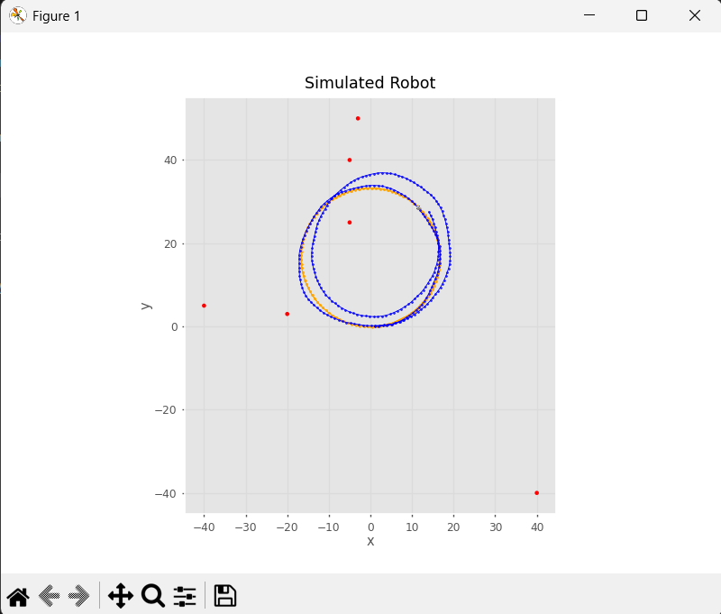
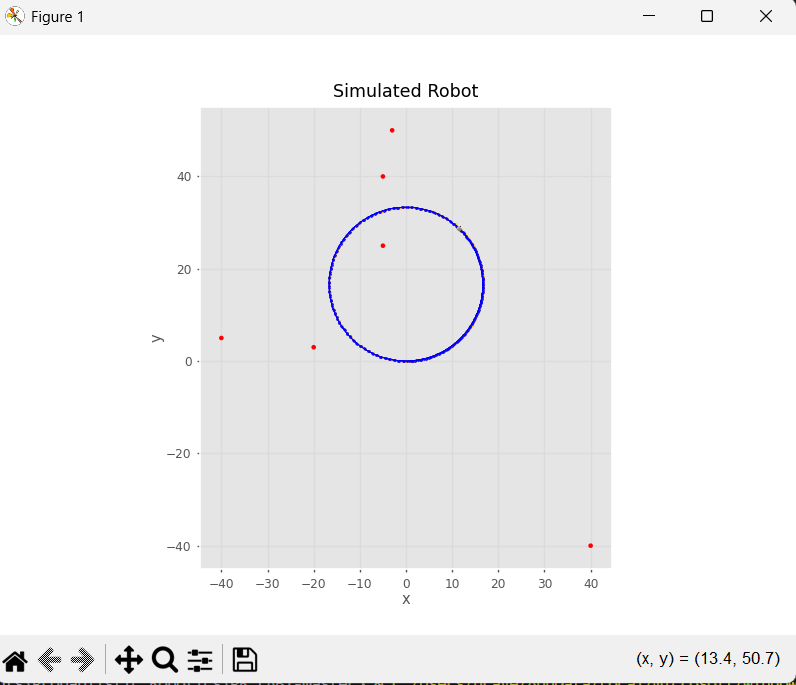

# Differential Drive Robot Modeling

    

This module implements the fundamental models for a differential drive mobile robot. It focuses on kinematic modeling of non-holonomic systems, 3DOF pose representations, rigorous discrete motion integration, error accumulation (dead reckoning), and trajectory validation.

This repository serves as a foundational robotics framework component to study the drift mechanics of dead reckoning systems before state estimation algorithms (e.g., Kalma Filters) are applied.

## Mathematical Model

### Kinematics
The differential drive kinematics are constrained by its non-holonomic nature. We read wheel encoder pulses and convert them into linear $(\Delta s)$ and angular $(\Delta \theta)$ displacements over a timestep $\Delta t$.

### 3DOF Pose Representation & Compounding
The robot's pose is strictly maintained as a 3DOF state: $x_k = [x_k, y_k, \theta_k]^T$. The compounding operation is fundamentally used to construct the global pose tracking over time.

### Discrete Integration
The state transition function updates the global coordinates using exact discrete integration approximation:
$$ x_k = x_{k-1} + \Delta s \cos(\theta_{k-1} + \frac{\Delta \theta}{2}) $$
$$ y_k = y_{k-1} + \Delta s \sin(\theta_{k-1} + \frac{\Delta \theta}{2}) $$
$$ \theta_k = \theta_{k-1} + \Delta \theta $$

### Error Accumulation Study
Encoder noise models the physical inaccuracies of the odometry. As time $t \to \infty$, positional drift accrues boundlessly without absolute localization. This repository models the exact error accumulation limits and bounds for different continuous trajectories.

## Experimental Validation

### Circular Trajectory
The circular trajectory simulation (`experiments/main_experiment.py`) provides baseline validation for symmetrical control inputs.

### Figure-Eight Trajectory
We implemented a figure-eight trajectory simulation (`experiments/test_experiment.py`) to actively study heading drift inversion. The continuous alternating angular velocity highlights asymmetrical compounding errors that linear trajectories or pure rotations often mask over short intervals.

## Framework Architecture
- `src/models/`: Core geometric representations, Pose derivations, and Non-holonomic drive models.
- `src/simulation/`: Discrete-time robot kinematic simulators.
- `src/localization/`: The pure dead-reckoning (odometry-only) open-loop localization implementation.

## Run Results
Experiments showcase the deviation between ground-truth simulation trajectory (often incorporating deterministic mechanical slip) and the encoder-based state estimates.

### Experimental Validation

The framework was validated through extensive simulations of a 3DOF differential drive robot. The dead-reckoning localization method was evaluated under different process and measurement noise configurations to isolate drift mechanics:

**Experiment 1: Realistic Dead-Reckoning (Non-Zero Noise)**  
Process and measurement noise covariances were set to non-zero values. The estimated trajectory deviates from the ground truth and continuously drifts, demonstrating the inherent limitation of pure odometry integration over time.  

**Experiment 2: Ideal Kinematics (Zero Noise)**  
Under zero noise, the kinematic model perfectly tracks the constant control inputs, yielding an exact overlap between ground truth and estimated paths. This configuration proves that the underlying numerical integration and transformation mathematics are fundamentally correct.  

